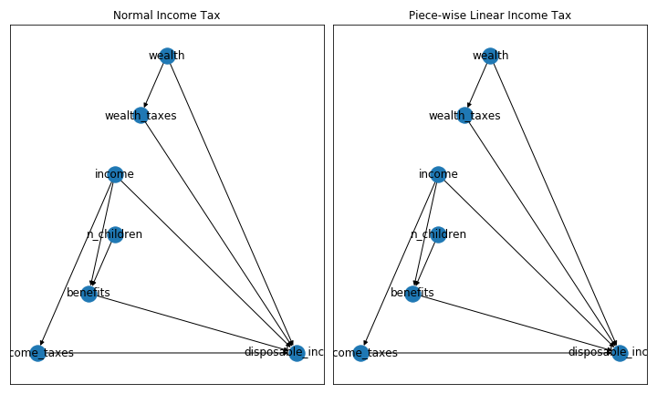
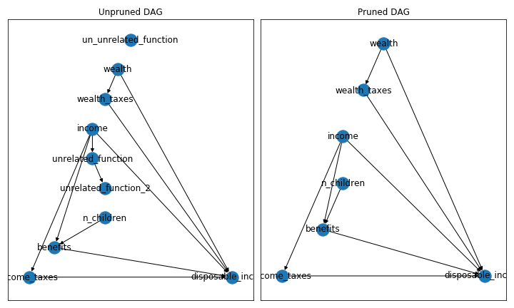

# dag_gettsim_tutorial

## Introduction

This repo shows how a user of [dag_gettsim](https://github.com/janosg/dag_gettsim) package can replace individual components of a stylized tax and benefit system.

## Running the tutorial

Follow the installation instruction from the dag_gettsim README.

Then type `python tutorial.py`

## Notebook and visualizations

The notebook offers to a way to study the DAG in more detail. Here are some exemplary
figures.

The first figure shows the DAG for the same model with different tax functions. Because
only the internals of the functions have changed, the DAG remains the same.

The second figure show what happens when a DAG is optimized and redundant parts are
pruned. On the left-hand-side you see a DAG which has three nodes which are completely
unrelated to the variable of interest, the disposable income. On the right-hand-side you
see the DAG has been pruned and unnecessary computations are saved.

